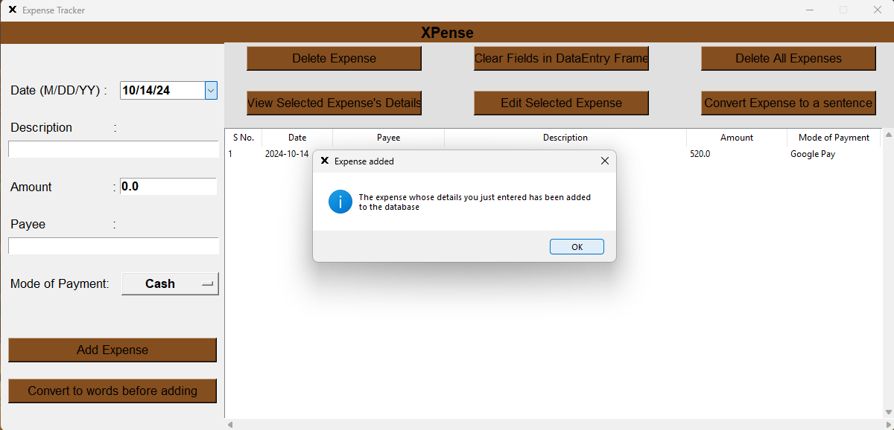

# XPense
XPense is a tool to keep track of your expenses.
Managing money is easier with Xpense.

# Project Images


## This is the page when we first open the app. The user can add details of his expense and save it.
---

## I have filled data for demonstration purposes.
---

## Upon saving the expense, we get a confirmation pop-up.
---

## This image shows the expense we just added, we can perform a lot of operations by selecting the expense listed in the table.

---
**⚠️ Important:** Please ensure everything is installed before running the project.
### Requirements: 
- Python 3.10.X or higher
- tkcalendar
  ```bash
  pip install tkcalendar

